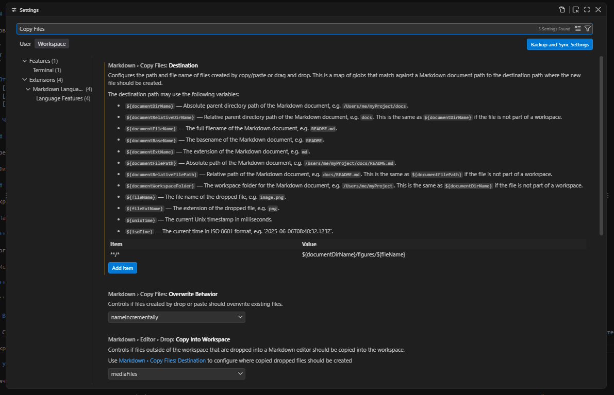

# Общая информация

## Материалы для повторения и самостоятельного изучения

1. [netacad.sadlab.su](https://netacad.sadlab.su/) — официальный NetAcad на русском языке на неофициальном сайте.
2. [linkmeup.ru](https://linkmeup.ru/blog/1188/) — «Сети для самых маленьких» (к концу цикла — для самых взрослых).
3. [networkeducation.ru](https://networkeducation.ru/video/) — библиотека видеокурсов по компьютерным сетям на русском языке.
4. [netlab.academy](https://netlab.academy/) — текстовый курс по всем основам с возможностью запускать лабы в браузере (сам не тестировал).
5. [zero rtt](https://vk.ru/00rtt) — видеокурсы на русском языке более продвинутого уровня (OPSF, MPLS, VxLAN).
6. [Alexandr Bezarov](https://youtube.com/@bezarov?si=b5PGUP-U1lruGlDr) — канал на YouTube с очень подробным циклом видео про IPsec.
7. [xgu.ru](http://xgu.ru/) — отличная русскоязычная вики по сетевым (и не только) технологиям.
8. [Python для сетевых инженеров](https://pyneng.readthedocs.io/ru/latest/) — книга от одной из главных авторов статей на xgu о том, как использовать Python для автоматизации работы с сетевой инфраструктурой.
9. «Компьютерные сети. Принципы, технологии и протоколы» (В. Олифер, Н. Олифер). Отлично ищется в Интернете.

## Выполнение лабораторных работ

Для выполнения лабораторной работы необходимо сделать **Fork** репозитория лабораторной работы. 

Затем выполните задание, загрузите в репозиторий правильно оформленный отчет со всеми необходимыми файлами и создайте запрос на слияние с основным репозиторием (Pull Request). В **Title** запроса укажите номер группы и ФИО выполнившего. 

Если потребуется что-то исправить, я напишу об этом в комментариях к запросу. Исправьте замечания и оставьте комментарий к запросу с просьбой о перепроверке. 

Если работа принята, я закрою запрос и оставлю соответствующий комментарий. 

## Требования к оформлению отчета по лабораторной работе

### 1. Общие правила сдачи
1. **Формат файла:** строго Markdown с расширением `.md`. Базовый синтаксис **Markdown** можно посмотреть [тут](https://docs.github.com/ru/get-started/writing-on-github/getting-started-with-writing-and-formatting-on-github/basic-writing-and-formatting-syntax).
2. **Именование файла:** `Лаб 1.2 НОМЕР ГРУППЫ ФИО.md` *(например, `Лаб 1.2 59 Иванов.md`)*.
3. **Целостность структуры:** нумерация частей, шагов и пунктов в отчете должна **соответствовать** нумерации в задании лабораторной работы. Не объединяйте шаги и не пропускайте пункты.

### 2. Правила оформления контента

#### Текстовые выводы команд (CLI) — только текстом!
* **Запрещено:** вставлять скриншоты черного экрана терминала/консоли с выводом команд (`show ip interface`, `ping`, `show ip nat translations` и т. д.).
* **Разрешено:** копировать текст из терминала Packet Tracer и оборачивать его в **блоки моноширинного кода** с тройными обратными кавычками ```` ```text ````.

#### Изображения и скриншоты графического интерфейса
* Скриншоты прикладываются **только** для тех шагов, где используется графический интерфейс (GUI): режим симуляции Packet Tracer (окно Simulation / Event List), веб-браузер на ПК (`Web Browser`).
* **Правило ссылок:** если отчет сдается в архиве/репозитории, изображения должны лежать в подпапке `figures/` рядом с файлом отчета с **относительными путями**:
  * Правильно: ``
  * Запрещено: ссылки на локальный диск студента (`C:\Users\admin\Desktop\image.png`).
  
#### Ответы на контрольные вопросы
* Ответы на вопросы не должны состоять из одного слова («да», «работает», «не сработало»).
* Ответ должен содержать **обоснование**: со ссылкой на вывод команды, статус протокола, флаг, код ошибки или строку списка доступа.

---

### 3. Пример готового отчета

````markdown
# Отчет по лабораторной работе 1.1
**Тема:** Базовая настройка, ARP, статическая маршрутизация  
**Выполнил:** Иванов И. И., гр. ИВТ-21  

## Часть 1: Создание топологии и начальная конфигурация устройств

### Шаг 1

Собрали схему в Packet Tracer и соединили устройства по таблице портов.


Настроили статические IP-адреса, маски и шлюзы на компьютерах `PC0`, `PC1` и `PC2`.

  
  
  

Через консоль выполнили базовую настройку `R1`, `R2` и `SW1` (задали hostname, пароли, шифрование, параметры консоли и IP на интерфейсах), после чего сохранили конфиг.

```
тут должен быть листинг команд
```

### Шаг 2

Проверили доступность узлов командой `ping` с `PC0` до `PC1` и `PC2`. Посмотрели таблицы MAC на `SW1` и ARP на `PC0` и `R1`.

```
тут должен быть листинг команд
```

**Ответы на вопросы:**
1. [Ваш ответ о результатах проверки связности]
2. [Ваше описание содержимого таблицы коммутации на SW1]
3. [Ваше описание содержимого таблиц ARP на PC0 и R1]

## Часть 2: Роль IP и MAC адреса при прямой и косвенной пересылке

### Шаг 1

Перешли в режим симуляции, настроили фильтр на протокол `ICMP` и отправили пинг с `PC0` на `PC2`.


### Шаг 2

Открыли пакет на `PC0` и изучили заголовки.


* **DEST MAC:** [Указать, чей MAC-адрес указан в кадре и объяснить, почему]

Прогнали симуляцию до `R1` и посмотрели `Outbound PDU Details`.


* **SRC и DEST MAC:** [Указать адреса и объяснить, почему они изменились]

````

## Вставка изображений при работе в VS Code

VS Code позволяет вставлять картинки в markdown документы прямо из буфера обмена. По умолчанию они сохраняются в той-же папке, что и документ. Чтобы не переносить картинки руками настройте **Destination** для файлов.

Откройте настройки (можно сочетанием клавиш `Ctrl+,`), в поиске введите *Copy Files*. Вам нужна настройка *Markdown > Copy Files: Destination*

Добавьте туда новый *Item*:

|Item|Value|
|---|---|
|`**/*`|`${documentDirName}/figures/${fileName}`|

> [!IMPORTANT]  
> Если вы работаете за компьютером в аудитории, то **ВСЕ** настройки добавляйте **ТОЛЬКО** для `Workspace`



## Установка Cisco Packet Tracer

Скачать Cisco Packet Tracer можно по ссылке [netacad.sadlab.su](https://netacad.sadlab.su/). 

Лабораторные работы создавались в версии 8 (v8), поэтому во избежание проблем рекомендуется устанавливать именно её. Там же доступен BAT-скрипт для создания правил файрвола, запрещающих программе Packet Tracer выход в Интернет. Без этого программа будет требовать обязательную авторизацию.

Скрипт:

```bat
@echo OFF
rem This bat file check if PacketTracer is installed and add firewall rule for block any trafiic from application
net session >nul 2>&1
if %errorLevel% == 0 (
		echo Success: Administrative permissions confirmed.
) else (
        echo Error: Try again with Administrator access!
		pause
		exit
)
echo Firewall must be turn on for this PT hack:
netsh advfirewall show allprofiles state
IF EXIST "%PT7HOME%\bin\PacketTracer7.exe" netsh advfirewall firewall add rule name="PT7_BlockTraffic" dir=out program="%PT7HOME%\bin\PacketTracer7.exe" profile=any action=block
IF EXIST "%PT8HOME%\bin\PacketTracer.exe" netsh advfirewall firewall add rule name="PT8_BlockTraffic" dir=out program="%PT8HOME%\bin\PacketTracer.exe" profile=any action=block
pause
```
